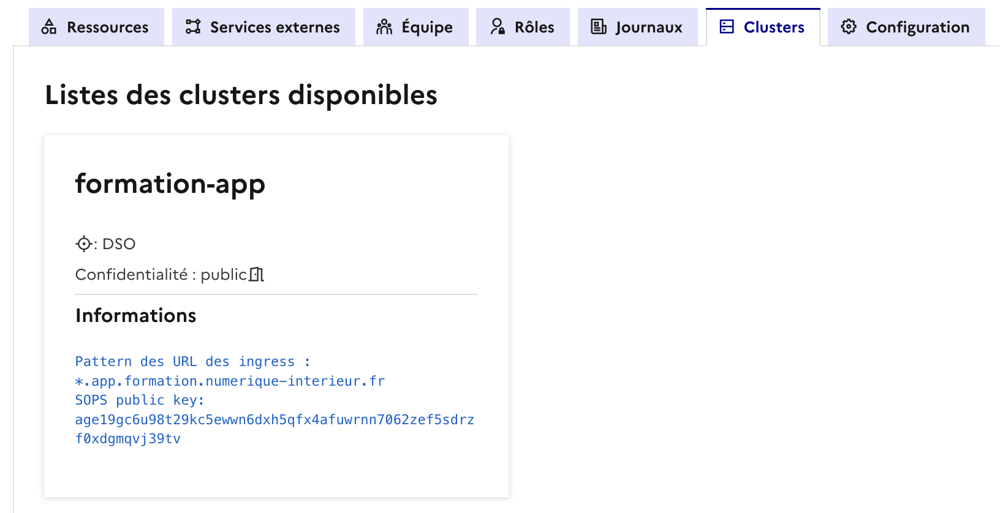

# Création d'un secret SOPS

## Installation / prérequis

> [!IMPORTANT]
> Il est nécessaire d'installer les deux utilitaires suivants pour manipuler les clés et effectuer le TP.

### SOPS

L'installation de SOPS se fait en suivant les instructions du site : [https://github.com/getsops/sops](https://github.com/getsops/sops). Sous 
Windows, l'installation peut se faire via l'utilitaire chocolatey : 

```bash
choco install sops
```

### AGE

Le format de clé utilisé sur CPiN est age : [https://github.com/FiloSottile/age](https://github.com/FiloSottile/age).

### Vérification

▶️ Afin de vérifier que SOPS et AGE ont bien été installés, lancez un terminal et vérifiez les commandes suivantes :
```bash
c:\> sops -v
sops 3.8.1 (latest)

c:\> age-keygen
# created: 2024-06-21T09:54:52+02:00
# public key: age187tmnp3ydzv6wvdl47tyysnakmvpmXXXXXXXXX
AGE-SECRET-KEY-10AR2NPHAYRN4NE4H2C5JUK0AM9NWW0XXXXXXXXXX  
```
La commande ci-dessus génère une paire de clé à titre d'exemple qui n'est pas utilisée dans ce TP.

## Gestion des secrets avec SOPS

### Récupération de la clé publique

Une clé publique SOPS propre à chaque cluster est déjà provisionnée dans votre projet. Elle est consultable à partir de 
l'onglet *Clusters* de la console CPiN.



### Créer le fichier contenant le secret

▶️ Créez en local sur votre machine, un fichier `exemple-sops.yaml` qui décrit un objet Kubernetes *SopsSecret* avec le
contenu suivant : 

```yaml
apiVersion: isindir.github.com/v1alpha3
kind: SopsSecret
metadata:
  name: mysecret-sops
spec:
  secretTemplates:
    - name: mysecret-sops
      labels:
        label1: label1-value1
      annotations:
      stringData:
        password: MySuperSecretPassword
```

> [!CAUTION]
> Ce fichier ne doit pas être ajouté dans un repo git, car il va contenir un secret.

### Chiffrer le secret avec la clé publique

▶️ Exécuter la commande suivante : 

```bash
sops -e --age [CLE_PUBLIQUE_SOPS_CLUSTER] --encrypted-suffix Templates ./exemple-sops.yaml > exemple-sops-enc.yaml
```

Cette commande chiffre les clés YAML se terminant par "Templates" dans le fichier `exemple-sops.yaml` et redirige le 
résultat dans un fichier ```exemple-sops-enc.yaml```.

Voici un exemple de contenu de fichier chiffré par SOPS :

```yaml
apiVersion: isindir.github.com/v1alpha3
kind: SopsSecret
metadata:
    name: mysecret-sops
spec:
    secretTemplates:
        - name: ENC[AES256_GCM,data:jmXw75slwbkdgbAb3Vo=,iv:tIl7v1lHVGOPTdpe/4SlQzlkD75z8LrA7Y2RizWI4ZQ=,tag:fjTg6sFGe33l2f7kyUOJiA==,type:str]
          labels:
            label1: ENC[AES256_GCM,data:LIzzKO0tQJCFzmgQsQ==,iv:xjqv3ecui5NtUTW7aRid6imF2RXMxlboAJ3v/32tbds=,tag:GmdQeeULVCb4emdZD4oRAA==,type:str]
          annotations: null
          stringData:
            password: ENC[AES256_GCM,data:/Goio3I3GBNT2KNGDNekLswXEagu,iv:LJJNpV7ezguoBJgFP3r3p1Y5VuswepsYKA2B3RjLWRo=,tag:iJ13qvscg8/RQb4E+BXJeA==,type:str]
sops:
    kms: []
    gcp_kms: []
    azure_kv: []
    hc_vault: []
    age:
        - recipient: age1qt7e329qjlhqsfsyxsvws56ukp2f9h0ktmj45atleqk0q406mfhstwnudv
          enc: |
            -----BEGIN AGE ENCRYPTED FILE-----
            YWdlLWVuY3J5cHRpb24ub3JnL3YxCi0+IFgyNTUxOSBRb2ZpSzk3RC9uZFd0OEs3
            WnpKb1R4dHduR3hvMHhRdktZc0dqdmZwM1dzClVCOS9zZDd1RWtQUys2cXBpaWFR
            TjhPWjh6T2h6dHV2S05obERFbTBXb28KLS0tIE8xSWl6WDMwTHdLQkRiL0ZIcWc3
            Q1lOc0pyZzVkSVVJelFQa0h4SUdNdTQKablj6RH3tZSZCsuk8r8sZ0x+sTgp/5qx
            ZFGVghD2lSb5QgVyT+9VJzuY4EapzD8F9PiB0U8Xus+7fgTYOuh5Gw==
            -----END AGE ENCRYPTED FILE-----
    lastmodified: "2025-11-13T10:31:22Z"
    mac: ENC[AES256_GCM,data:N1e0k+jkxlUXLbm/qsdBFfNV7tnoOIBgp81NNiqMBjWC0H/X7MXKUXyWgRraW2UILFo7EqyEswbjmDaOtvplOOTULr3M+AvaAg0KFlkijFYm3TlUDBxqdoHpFrtJU8tXUTLArbVUgA/ArTejnZUHF/YkhAFYKCy3i3VfKbvAoyI=,iv:MreOORxFAn+xAr0SjDMVFbp7Q1TumdAC++NahQd/mYo=,tag:0w9sVyjUgpjz0vEAlAAwRA==,type:str]
    pgp: []
    encrypted_suffix: Templates
    version: 3.8.1
```

On voit que toutes les valeurs en dessous de la clé ***secretTemplates*** sont chiffrées et que dans la partie 
***sops***, le ***recipient*** correspond bien à la clé publique du cluster.

Le fichier `exemple-sops-enc.yaml` peut maintenant être envoyé dans le dépôt Git, car son contenu est chiffré et les 
éléments sensibles ne peuvent être déchiffrés par personne d'autre que le cluster qui détient la clé privée.

### Déploiement

Pour déployer ce secret, vous devez l'ajouter à votre dépôt de code d'infrastructure.

▶️ Ajoutez le fichier `exemple-sops-enc.yaml` dans le répertoire *templates* du chart helm de déploiement (dépôt 
*demo-java-infra*) dans la branche ***tuto***. Une fois que le fichier est créé, *commit* puis *push*, retournez dans 
votre application sur ArgoCD et cliquez sur le bouton *SYNC* puis *SYNCHRONIZE* pour voir s'appliquer vos modifications.

> [!TIP]
> Si votre application dans ArgoCD n'apparait pas encore comme *OutOfSync* après l'ajout de votre fichier, vous avez 
> la possibilité de cliquer sur le bouton *REFRESH*. Voici le détail de chacune de ces opérations sur ArgoCD :
> - SYNC: Réconcilie l'état courant de l'application avec l'état cible décrit par votre code source 
> - REFRESH: Récupère la dernière version de vos manifests (fichiers source) depuis le dépôt Git et compare la 
> différence.
> - Hard Refresh: Invalide la version des manifests présente en cache présente dans ArgoCD avant d'effectuer une
> opération de *Refresh*

▶️ Vérifiez dans ArgoCD que votre secret est bien ajouté :


En cliquant sur l'objet *secret*, vous pouvez accéder aux détails du secret.


Pour réutiliser un secret existant dans votre infrastructure, vous avez la possibilité de le référencer comme dans 
l'exemple ci-dessous :

```yaml
            - name: SPRING_DATASOURCE_PASSWORD
              valueFrom:
                secretKeyRef:
                  key: password
                  name: mysecret-sops
```
