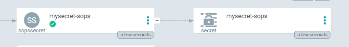
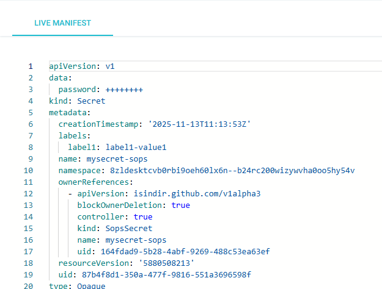

# Creation d'un secret SOPS

## Installation / prérequis

### SOPS

L'installation de SOPS se fait en suivant les instructions du site : [https://github.com/getsops/sops](https://github.com/getsops/sops). Sous Windows, l'installation peut se faire via l'utilitaire chocolatey : 

```bash
choco install sops
```

### AGE

Le format de clé utilisé sur CPiN est age [https://github.com/FiloSottile/age](https://github.com/FiloSottile/age)

Il est nécessaire d'installer cet utilitaire pour manipuler les clés.

### Vérification

Afin de vérifier que SOPS et AGE ont bien été installé lancer un terminal et vérifier les commandes suivantes 

```bash
c:\> sops -v
sops 3.8.1 (latest)

c:\> age-keygen
# created: 2024-06-21T09:54:52+02:00
# public key: age187tmnp3ydzv6wvdl47tyysnakmvpmXXXXXXXXX
AGE-SECRET-KEY-10AR2NPHAYRN4NE4H2C5JUK0AM9NWW0XXXXXXXXXX  
```
La commande ci-dessus génère une paire de clé d'exemple qui n'est utilisée qu'à titre d'exemple.

## Gestion des secrets avec SOPS

### Récupératoin de la clé publique

La clé publique SOPS est propre à chaque cluster, consultable à partir de l'onglet Clusters de la console 


Exemple pour le cluster de formation : age1qt7e329qjlhqsfsyxsvws56ukp2f9h0ktmj45atleqk0q406mfhstwnudv

### Créer le fichier contenant le secret

Créer un fichier Yaml pour créer un SopsSecret comme suit : 

```yaml
apiVersion: isindir.github.com/v1alpha3
kind: SopsSecret
metadata:
  name: mysecret-sops
spec:
  secretTemplates:
    - name: mysecret-sops
      labels:
        label1: label1-value1
      annotations:
      stringData:
        password: MySuperSecretPassword
```

>  /!\ Ce fichier ne doit pas être mis dans un repo git /!\

### Chiffrer le secret avec la clé publique

Exécuter la commande suivante : 

```bash
sops -e --age age1qt7e329qjlhqsfsyxsvws56ukp2f9h0ktmj45atleqk0q406mfhstwnudv --encrypted-suffix Templates ./exemple-sops.yaml > exemple-sops-enc.yaml
```

Cette commande chiffre les clés YAML se terminant par "Templates" du fichier ```exemple-sops.yaml``` et redirige le résultat dans le fichier ```exemple-sops-enc.yaml```.

Voici le contenu du fichier chiffré :

```yaml
apiVersion: isindir.github.com/v1alpha3
kind: SopsSecret
metadata:
    name: mysecret-sops
spec:
    secretTemplates:
        - name: ENC[AES256_GCM,data:jmXw75slwbkdgbAb3Vo=,iv:tIl7v1lHVGOPTdpe/4SlQzlkD75z8LrA7Y2RizWI4ZQ=,tag:fjTg6sFGe33l2f7kyUOJiA==,type:str]
          labels:
            label1: ENC[AES256_GCM,data:LIzzKO0tQJCFzmgQsQ==,iv:xjqv3ecui5NtUTW7aRid6imF2RXMxlboAJ3v/32tbds=,tag:GmdQeeULVCb4emdZD4oRAA==,type:str]
          annotations: null
          stringData:
            password: ENC[AES256_GCM,data:/Goio3I3GBNT2KNGDNekLswXEagu,iv:LJJNpV7ezguoBJgFP3r3p1Y5VuswepsYKA2B3RjLWRo=,tag:iJ13qvscg8/RQb4E+BXJeA==,type:str]
sops:
    kms: []
    gcp_kms: []
    azure_kv: []
    hc_vault: []
    age:
        - recipient: age1qt7e329qjlhqsfsyxsvws56ukp2f9h0ktmj45atleqk0q406mfhstwnudv
          enc: |
            -----BEGIN AGE ENCRYPTED FILE-----
            YWdlLWVuY3J5cHRpb24ub3JnL3YxCi0+IFgyNTUxOSBRb2ZpSzk3RC9uZFd0OEs3
            WnpKb1R4dHduR3hvMHhRdktZc0dqdmZwM1dzClVCOS9zZDd1RWtQUys2cXBpaWFR
            TjhPWjh6T2h6dHV2S05obERFbTBXb28KLS0tIE8xSWl6WDMwTHdLQkRiL0ZIcWc3
            Q1lOc0pyZzVkSVVJelFQa0h4SUdNdTQKablj6RH3tZSZCsuk8r8sZ0x+sTgp/5qx
            ZFGVghD2lSb5QgVyT+9VJzuY4EapzD8F9PiB0U8Xus+7fgTYOuh5Gw==
            -----END AGE ENCRYPTED FILE-----
    lastmodified: "2025-11-13T10:31:22Z"
    mac: ENC[AES256_GCM,data:N1e0k+jkxlUXLbm/qsdBFfNV7tnoOIBgp81NNiqMBjWC0H/X7MXKUXyWgRraW2UILFo7EqyEswbjmDaOtvplOOTULr3M+AvaAg0KFlkijFYm3TlUDBxqdoHpFrtJU8tXUTLArbVUgA/ArTejnZUHF/YkhAFYKCy3i3VfKbvAoyI=,iv:MreOORxFAn+xAr0SjDMVFbp7Q1TumdAC++NahQd/mYo=,tag:0w9sVyjUgpjz0vEAlAAwRA==,type:str]
    pgp: []
    encrypted_suffix: Templates
    version: 3.8.1


```

On voit que toutes les valeurs en dessous de la clé ```secretTemplates``` sont chiffrées et dans la partie sops le recipient est bien la clé publique du cluster age1qt7e329qjlhqsfsyxsvws56ukp2f9h0ktmj45atleqk0q406mfhstwnudv.

> Le fichier  ```exemple-sops-enc.yaml``` peut être envoyé dans le repo git car le contenu des éléments sensible est chiffré.

### Déploiement

Ajouter le fichier ```exemple-sops-enc.yaml``` aux templates du chart helm de déploiement et vérifier dans ArgoCD qu'un secret associé est bien généré :



Et le detail du secret



Il est maintenant possible de modifier le deploiement pour référencer ce secret et changer :

```yaml
            - name: SPRING_DATASOURCE_PASSWORD
              valueFrom:
                secretKeyRef:
                  key: password
                  name: mysecret-sops
```
