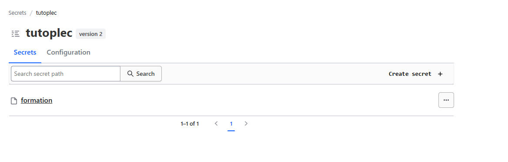
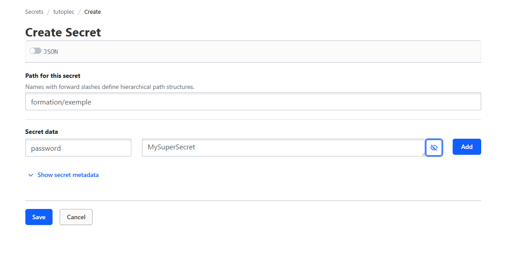
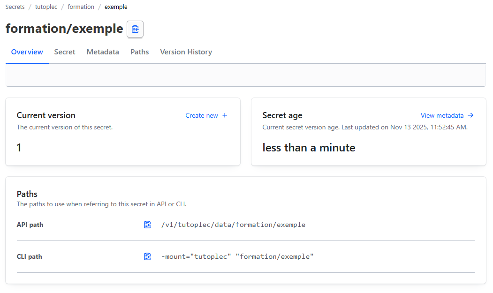
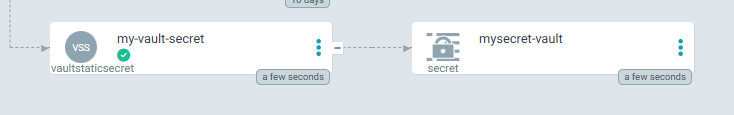
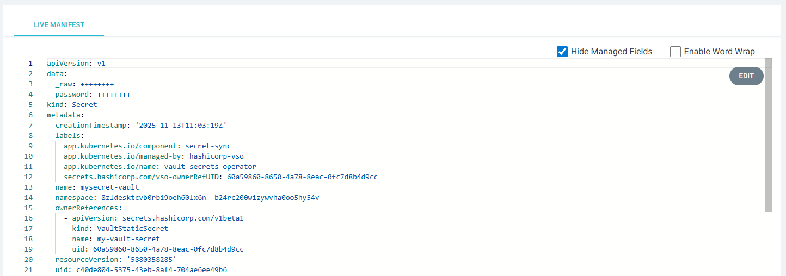

# Création d'un secret avec Vault

## Création d'un secret via l'interface web de Vault

▶️ Ouvrez Vault en cliquant sur la tuile de Vault sous l'onglet **Services externes**. Une nouvelle fenêtre s'ouvre pour
s'authentifier, cliquez sur le bouton bleu **Sign in with OIDC provider** :


Une fois authentifié, vous retrouvez un espace associé à votre projet (dans la nomenclature Hashicorp ce nom sera 
référencé en tant que **mount**).



▶️ Pour créer un nouveau secret, cliquez sur le bouton à droite **Create secret +**, et remplissez les champs suivants :
- `Path for this secret`: le chemin vers le secret dans le coffre. L'arborescence choisie, même complexe, est 
automatiquement créée (dans la nomenclature Hashicorp ce nom sera référencé en tant que **path**)
- `Secret data`: les données secrètes sous la forme clé-valeur



▶️ Cliquez sur le bouton bleu **Save** pour enregistrer le nouveau secret. Une fois le secret créé, vault renvoie vers 
l'arborescence du secret (dans l'exemple `formation/`, où se trouve le secret **exemple**) :



## Création du secret

L'opérateur [Vault Secret Operator](https://developer.hashicorp.com/vault/tutorials/kubernetes/vault-secrets-operator)
est installé sur les clusters afin de récupérer les secrets auprès de vault.

Pour chaque projet créé dans la console, des objets de type `VaultConnection` et `VaultAuth` sont automatiquement créés
afin de pouvoir authentifier le projet.

La récupération d'un secret passe par la création d'un objet de type `VaultStaticSecret` qui lui-même va générer un
secret kubernetes.

▶️ Depuis Gitlab, allez dans le projet `demo-java-infra` et vérifiez que vous êtes bien sur la branche **tuto**. 
Ouvrez le répertoire **templates** du chart helm de déploiement et cliquez sur le bouton `+`>`New file`. Appelez votre 
fichier `vault-exemple.yml`.

▶️ Ajoutez le contenu suivant :

```yaml
apiVersion: secrets.hashicorp.com/v1beta1
kind: VaultStaticSecret
metadata:
  name: my-vault-secret
spec:
  vaultAuthRef: vault-auth # Nom du VaultAuth, toujours vault-auth dans le cas de CPiN
  mount: MON_COFFRE # Nom du coffre dans vault (correspond slug du projet visible depuis la console, en général le nom du projet)
  path: formation/exemple # Chemin vers le secret
  type: kv-v2 # Type du coffre, toujours kv-v2 dans le cas de CPiN
  destination:
    name: mysecret-vault # Nom du secret kubernetes que l'opérateur va créer
    create: true
```

▶️ Remplacez les champs suivants dans le fichier :
- `mount` : nom du coffre qui correspond au nom de votre projet, voir plus haut la notion de **mount**
- `path` : chemin vers votre secret, si vous avez recopié l'exemple, laissez la valeur proposée

Ce fichier ne contient pas d'information sensible et peut donc être ajouté au dépôt d'infrastructure.

## Déploiement

Une fois que le fichier est créé, *commit* puis *push*, retournez dans votre application sur ArgoCD et cliquez sur le 
bouton *SYNC* puis *SYNCHRONIZE* pour voir s'appliquer vos modifications.

> [!TIP]
> Si votre application dans ArgoCD n'apparait pas encore comme *OutOfSync* après l'ajout de votre fichier, vous avez
> la possibilité de cliquer sur le bouton *REFRESH*. Voici le détail de chacune de ces opérations sur ArgoCD :
> - SYNC: Réconcilie l'état courant de l'application avec l'état cible décrit par votre code source
> - REFRESH: Récupère la dernière version de vos manifests (fichiers source) depuis le dépôt Git et compare la
    > différence.
> - Hard Refresh: Invalide la version des manifests présente en cache présente dans ArgoCD avant d'effectuer une
    > opération de *Refresh*

▶️ Vérifiez dans ArgoCD que votre secret est bien ajouté :



En cliquant sur l'objet *secret*, vous pouvez accéder aux details du secret.



Pour réutiliser un secret existant dans votre infrastructure, vous avez la possibilité de le référencer comme dans
l'exemple ci-dessous :

```yaml
            - name: SPRING_DATASOURCE_PASSWORD
              valueFrom:
                secretKeyRef:
                  key: password
                  name: mysecret-vault
```
