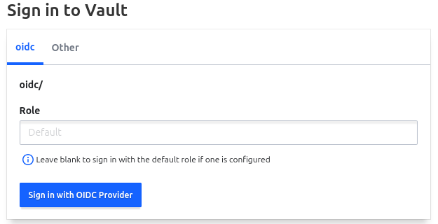
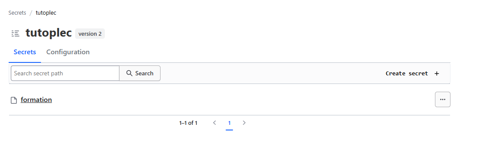
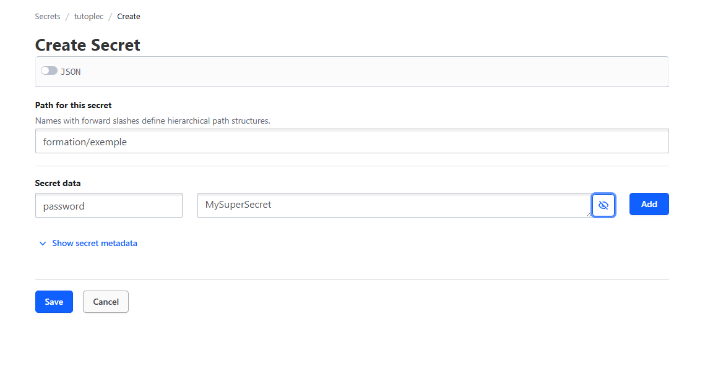
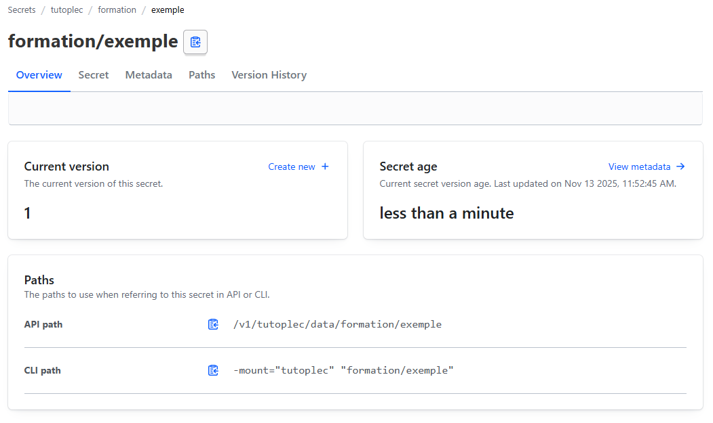
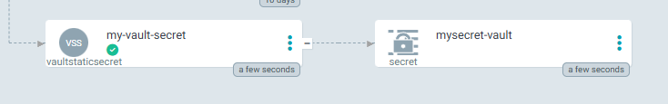
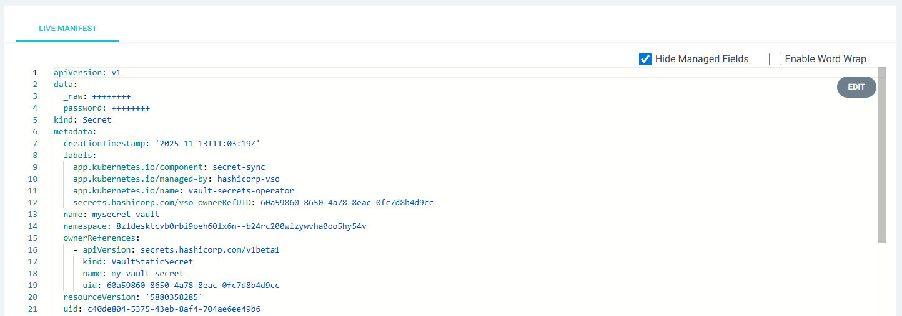

# Création d'un secret avec Vault

## Création d'un secret via l'interface web de Vault

▶️ Ouvrez Vault en cliquant sur sa tuile dans l'onglet **Services externes** de la console CPiN. Une nouvelle fenêtre
s'ouvre pour vous authentifier : cliquez sur le bouton bleu **Sign in with OIDC provider**.



Une fois authentifié, vous accédez à un coffre associé à votre projet (dans la nomenclature HashiCorp, ce coffre est
appelé **mount**).



▶️ Pour créer un nouveau secret, cliquez sur le bouton **Create secret +** à droite, puis remplissez les champs
suivants :

- `Path for this secret` : le chemin du secret dans le coffre, par exemple `formation/exemple`. L'arborescence choisie,
  même complexe, est créée automatiquement (dans la nomenclature HashiCorp, ce chemin est appelé **path**).
- `Secret data` : les données secrètes, sous forme de paires clé-valeur. Pour suivre l'exemple, créez une clé
  `password`.



▶️ Cliquez sur le bouton bleu **Save** pour enregistrer le nouveau secret. Vault affiche ensuite l'arborescence du
secret (dans l'exemple, le dossier `formation/` contient le secret **exemple**) :



## Synchronisation du secret dans le cluster

L'opérateur [Vault Secrets Operator](https://developer.hashicorp.com/vault/tutorials/kubernetes/vault-secrets-operator)
est installé sur les clusters afin de récupérer les secrets depuis Vault.

Pour chaque projet créé dans la console, des objets de type `VaultConnection` et `VaultAuth` sont automatiquement créés
afin d'authentifier le projet auprès de Vault.

La récupération d'un secret passe par la création d'un objet de type `VaultStaticSecret`, qui génère à son tour un
`Secret` Kubernetes.

▶️ Depuis GitLab, ouvrez le projet `demo-java-infra` et vérifiez que vous êtes bien sur la branche **tuto**. Ouvrez le
répertoire `templates` du chart Helm de déploiement et cliquez sur **+** > **New file**. Nommez votre fichier
`vault-exemple.yaml`.

▶️ Ajoutez le contenu suivant :

```yaml
apiVersion: secrets.hashicorp.com/v1beta1
kind: VaultStaticSecret
metadata:
  name: my-vault-secret
spec:
  vaultAuthRef: vault-auth # Nom du VaultAuth, toujours vault-auth sur CPiN
  mount: MON_COFFRE # Nom du coffre dans Vault (slug du projet visible dans la console, en général le nom du projet)
  path: formation/exemple # Chemin vers le secret
  type: kv-v2 # Type du coffre, toujours kv-v2 sur CPiN
  destination:
    name: mysecret-vault # Nom du Secret Kubernetes que l'opérateur va créer
    create: true
```

▶️ Adaptez les champs suivants :

- `mount` : nom du coffre, c'est-à-dire le slug de votre projet (voir plus haut la notion de **mount**).
- `path` : chemin vers votre secret. Si vous avez repris l'exemple, laissez la valeur proposée.

Ce fichier ne contient aucune information sensible et peut donc être ajouté au dépôt d'infrastructure.

## Déploiement

▶️ Enregistrez le fichier avec **Commit changes**, retournez dans votre application sur ArgoCD et cliquez sur le bouton
*SYNC* puis *SYNCHRONIZE* pour appliquer vos modifications.

> [!TIP]
> Si votre application n'apparaît pas encore comme *OutOfSync* dans ArgoCD après l'ajout de votre fichier, vous pouvez
> cliquer sur le bouton *REFRESH*. Voici le détail de chacune de ces opérations dans ArgoCD :
>
> - *SYNC* : réconcilie l'état courant de l'application avec l'état cible décrit par votre code source.
> - *REFRESH* : récupère la dernière version de vos manifests depuis le dépôt Git et la compare à l'état courant.
> - *HARD REFRESH* : invalide le cache des manifests d'ArgoCD avant d'effectuer un *REFRESH*.

▶️ Vérifiez dans ArgoCD que votre secret a bien été ajouté :



En cliquant sur l'objet *secret*, vous accédez à ses détails.



Pour utiliser ce secret dans votre infrastructure, référencez-le par exemple dans les variables d'environnement d'un
conteneur :

```yaml
env:
  - name: SPRING_DATASOURCE_PASSWORD
    valueFrom:
      secretKeyRef:
        name: mysecret-vault
        key: password
```

Bravo, vous avez terminé ce TP ! Revenez à la gestion des secrets pour [continuer](../README.md).
